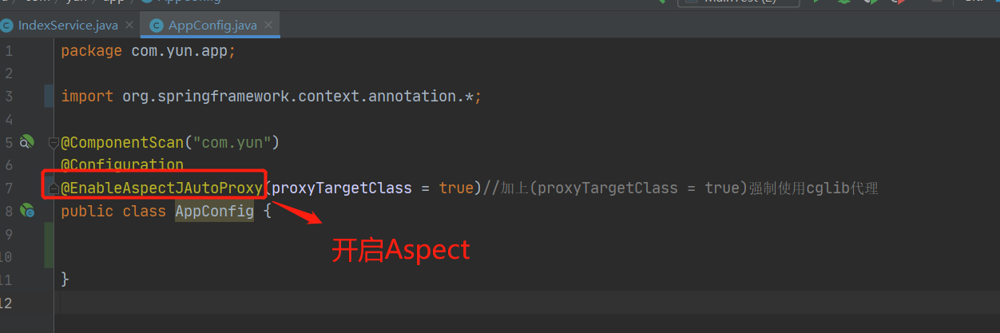
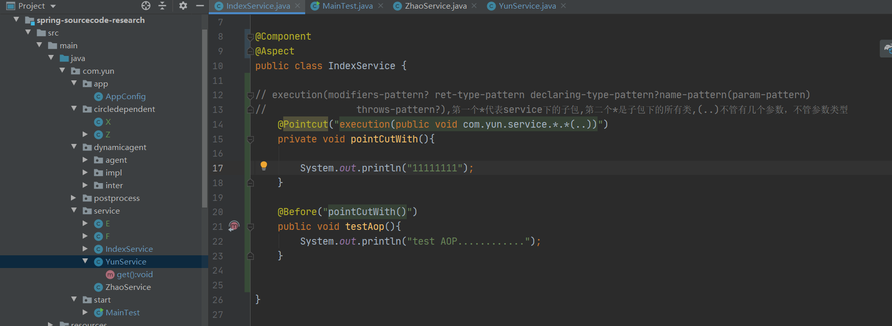

## AOP 
### 基本原理及应用  
BeanPostProcessor--bean的后置处理器--干预bean初始化和实例化的过程；  
BeanPostProcessor---创建--改变一个对象（bean）{
    在不同的时机调用不同的BeanPostProcessor
}  
spring内部是通过 BeanPostProcessor后置处理器中的postProcessAfterInitialization方法完成AOP代理的  
1、Aspect--切面：  
2、Join point--连接点：增强对象或者类中的某个方法；
3、pointCut--切点：某一类型连接点的集合；  
3、advice--通知：  
3.1、逻辑  
3.2、执行时机  
4、target 目标对象：  
5、proxy 代理对象：  
6、weaving 织入：  
### 开启代理  
  
@Aspect注解在如下包中
~~~
        <dependency>
            <groupId>org.aspectj</groupId>
            <artifactId>aspectjweaver</artifactId>
            <version>1.9.2</version>
        </dependency>
~~~
  
this表示代理对象  
target表示目标对象