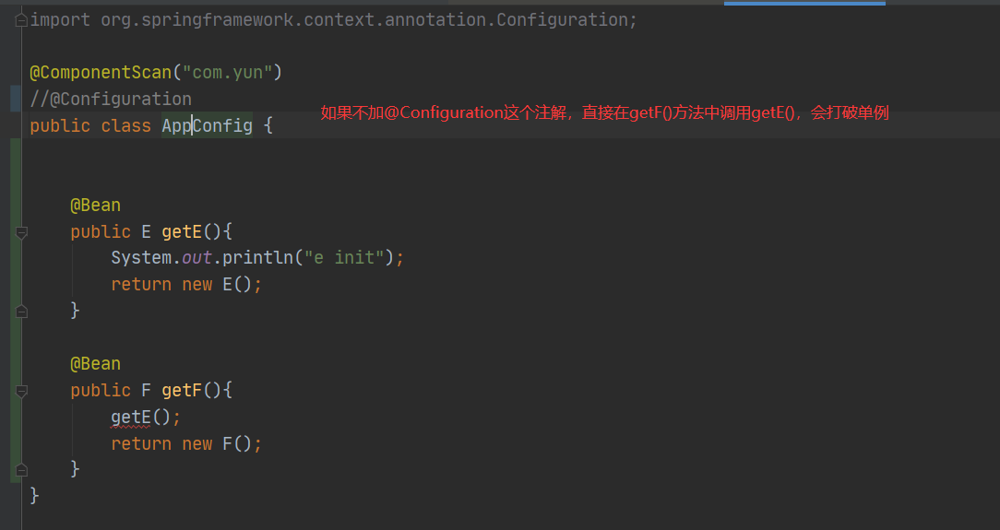

## BeanFactoryPostProcessor与BeanDefinitionRegistryPostProcessor  

BeanFactoryPostProcessor：可以通过后置处理器，改变beanDefinition，也可以将自己的类，没有加@Component注解的类放到spring容器中，也就是说执行完后置处理器beanDefinitionMap会被完全填充完。所有的bean都会解析成beanDefinition，并且放在map里供后续实例化使用。
~~~
void postProcessBeanFactory(ConfigurableListableBeanFactory beanFactory) throws BeansException;
~~~
~~~
@Component
public class TestBeanFactoryPostPorcessor implements BeanFactoryPostProcessor {
	@Override
	public void postProcessBeanFactory(ConfigurableListableBeanFactory beanFactory) throws BeansException {
		//转换为子类，因为父类没有添加beanDefintion对象的api
		DefaultListableBeanFactory defaultbf =
				(DefaultListableBeanFactory) beanFactory;

		//new一个Y的beanDefinition对象，方便测试动态添加
		GenericBeanDefinition y= new GenericBeanDefinition();
		y.setBeanClass(Y.class);
		//添加一个beanDefinition对象，原本这个Y没有被spring扫描到
		defaultbf.registerBeanDefinition("y", y);

		//得到一个已经被扫描出来的beanDefintion对象x
		//因为X本来就被扫描出来了，所以是直接从map中获取
		BeanDefinition x = defaultbf.getBeanDefinition("x");
		//修改这个X的beanDefintion对象的class为Z
		//原本这个x代表的class为X.class；现在为Z.class
		x.setBeanClassName("com.luban.beanDefinition.Z");
	}
	
}

~~~
项目里面有三个类X，Y，Z其中只有X加了@Component注解；也就是当代码执行到上面那个方法的时候只扫描到了X；beanFactory里的beanDefinitionMap当中也只有X所对应的beanDefinition对象；笔者首先new了一个Y所对应的beanDefinition对象然后调用registerBeanDefinition("y", y)；把y对应的beanDefinition对象put到beanDefinitionMap，这是演示动态添加一个自己实例化的beanDefinition对象；继而又调用getBeanDefinition("x")得到一个已经存在的beanDefinition对象，然后调用x.setBeanClassName("Z");把x所对应的beanDefinition对象所对应的class改成了Z，这是演示动态修改一个已经扫描完成的beanDefinition对象；
测试代码：  
~~~
public static void main(String[] args) {
		AnnotationConfigApplicationContext ac =
		 new AnnotationConfigApplicationContext();
		ac.register(Appconfig.class);
		ac.refresh();
		//正常打印
		System.out.println(ac.getBean(Y.class));
		//正常打印
		System.out.println(ac.getBean(Z.class));
		//异常打印
		//虽然X加了注解，但是被偷梁换柱了，故而异常
		System.out.println(ac.getBean(X.class));
	}

~~~

bean工厂的后置处理器，执行时机？
首先根据程序员通过API提供的  
~~~
 AnnotationConfigApplicationContext aac = new AnnotationConfigApplicationContext(AppConfig.class);

        aac.addBeanFactoryPostProcessor(new LiuBeanFactoryPostprocessor());
~~~
然后执行内置的，首先执行实现PriorityOrdered.class  
其次执行：Ordered.class接口的  
最后执行程序员提供的，没有任何特点的

ConfigurationClassPostProcessor spring当中最重要的类。

## @Bean 和@Component 区别：
@Bean可以控制对象的产生过程；
@Component是把对象的产生过程交给了spring去控制。  
  
加上@Configuration注解，会通过CGLIB代理的方式改变了getF()方法内部逻辑。其实是通过CGLIB代理了AppCongif这个类。通过@Scope("prototype")注解可以获取原型模式  
@Configuration，加这个注解是为了保证AppConfig可以产生一个代理对象，来保证@Bean注解类的单例原则。  

会把当前创建bean的方法和内部调用的方法进行对比，如果一样就执行父类的方法创建bean否则执行代理生成的子类逻辑去创建bean