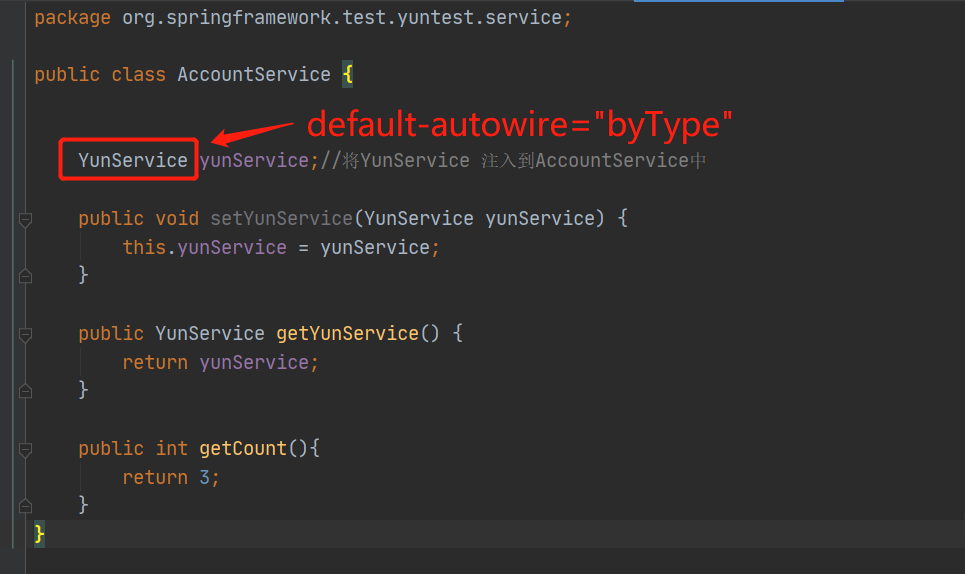
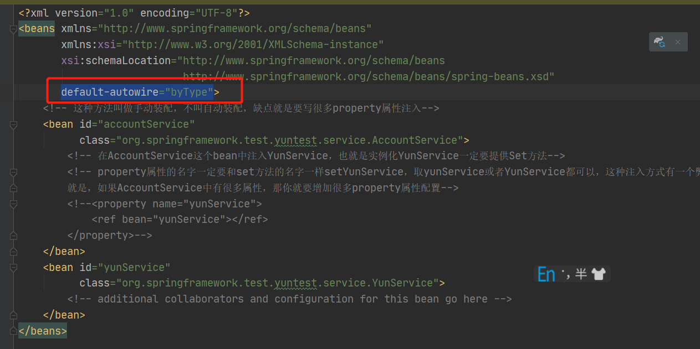
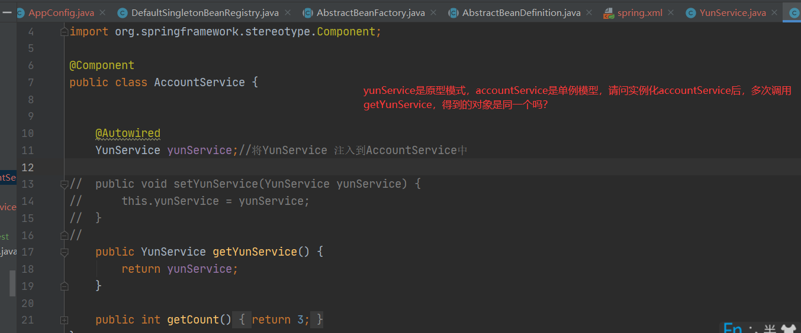
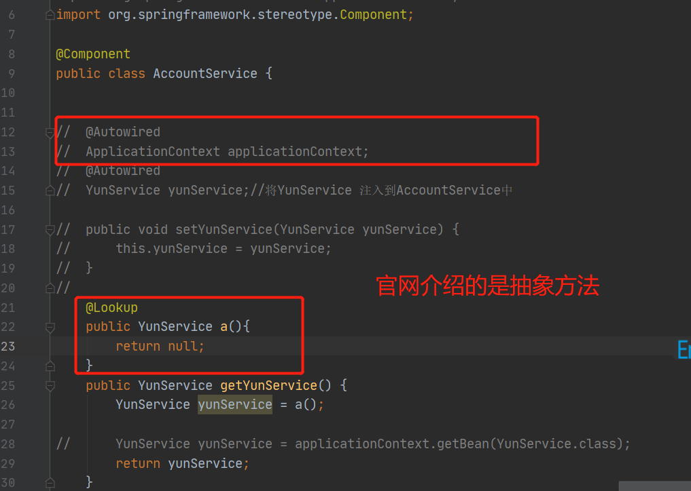
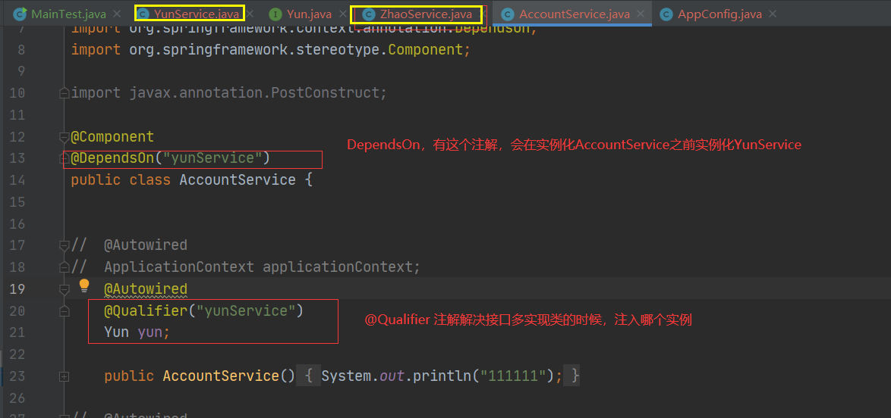
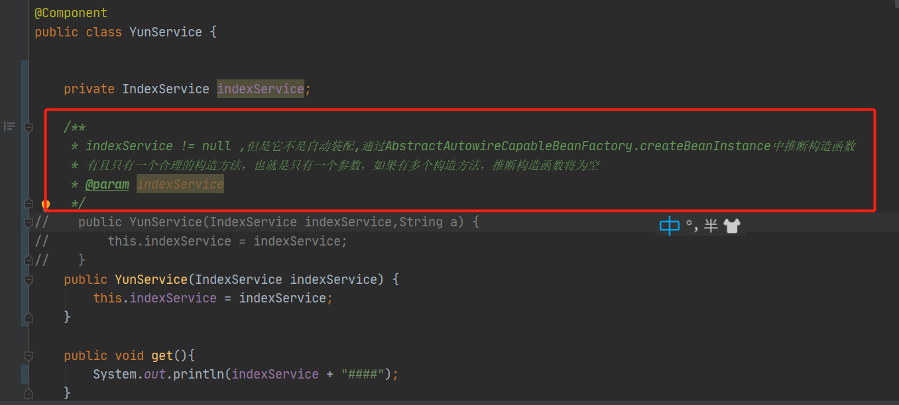

## spring  
### IOC 和 DI 的关系  
spring官网中有解释，说IOC也被称作DI  
spring bean一定是个java对象，但是一个java对象有可能不是一个bean。bean是可以通过spring容器中拿出来。  
### 初始化spring容器  
所谓初始化spring容器就是解析xml文件，初始化文件中配置内容。
### Bean OverView  
spring自动注入  
面试：spring的***手动*** 注入方式有哪几种方法？  
阿里巴巴----》有2种   
官网说只有2种：构造方法和setter方法，但是在使用自动注入方式的话有4种注入模型，如下：
~~~
Autowiring modes：有四种自动注入模型，仅仅针对xml方式
NO：不采用自动注入
byName：根据名字
byType：根据类型，要提供set方法
constructor：根据构造函数去找，这个比较麻烦，因为如果一个类中有很多构造方法，会去推断构造方法。如果构造方法中的参数均在容器中，那将会使用最长参数的构造方法。
~~~

如果采用注解或者javaConfig方式，是没有注入模型的。
@Autowired ：是先通过类型去找，找不到通过名称去找，所以这种方式不是byType的自动注入，不叫自动注入，不需要set方法 。     
default-autowire="byType" 这种自动注入方式是通过类型注入，也就是说，AccountService这个类中有一个属性，并且提供了set方法，就会根据属性的类型注入进来，和set的名字无关，这个byType 不等于@Autowired  
  
  

@Autowired 和 @Resources 区别  
1、@Autowired spring提供的注解是由 AutowiredAnnotationBeanPostProcessor 这个类来解析的，先通过type找，在根据name。  

2、@Resource java提供的注解是由CommonAnnotationBeanPostProcessor来解析，先通过name，在通过type  
### 原型和单例  
原型模型是在getBean的时候实例化，单例是在容器初始化的时候就将对象放在了单例池中。
原型模式是每次getbean的时候都会的到一个新的对象；  

如果注入的对象是原型模式，那得到的是注入对象是单例模式吗？  
   
~~~
是单例模式。因为AccountService是单例的，只会实例化一次。
扩展1：如果想得到原本的原型模式该怎么办？？看图4，或者使用@Lookup注解 参考“1.4.6. Method Injection”
扩展2：如果yunService是单例的，那他被注入到不同的对象中，yunservice是同一个对象吗？
因为是单例，所以相同
~~~  
  

~~~
问题1、spring当中，一个对象被实例化后就执行某些方法，如何做？（1.6.1. Lifecycle Callbacks）在该方法上增加@PostConstruct注解，这个注解会在属性初始化之后，顺序是，构造函数---> 属性注入--> 属性实例对应的构造函数--->@PostConstruct修饰的方法，有三种方法实现参考文档：Combining Lifecycle Mechanisms，如果三种方法都使用了，先后的顺序是怎样的？先注解——》在接口实现——》在是配置方式,那为什么不在构造函数中直接调用方法呢？因为构造函数中执行方法，属性是没进行注入的，也就是说如果方法中用到属性对象实例的话，在构造方法中执行方法是不行的。如果注解和xml都配置了，只会执行一次

问题2、当spring容器初始化之后，立马执行某些逻辑？Mq在spring初始化之后立马工作（Startup and Shutdown Callbacks）
（1）、类去实现Lifecycle接口，但是，这种方式必须显示调用，所以没卵用；
（2）、类去实现Lifecycle接口SmartLifecycle接口，然后isAutoStartup()方法要返回true，就会自动调用star()方法。
~~~  
自动装配---》注入技术是setter方法和构造方法  
@Autowired 是通过fileld.set，是通过反射将实例给了属性  
### @DependsOn @Qualifier  @Lazy(true)  
  
@Lazy(true) 如果类上标注了这个注解，那初始化容器的时候不会实例化这个bean，只有显示调用getBean的时候会去实例化，而且是只实例化一次，和原型@Scope("prototype")是不同的
### 把一个对象放在spring容器中 
1、@Bean注解 
2、aac.getBeanFactory().registerSingleton("xxx",Xxx.class);
3、FactoryBean
以上三种方式是对象的是对象的实例化过程由你自己去控制
@Component，是把一个类交给spring管理，完全由spring去控制对象的实例化

### 补充 
  
default-autowire="byName" 这种方式是根据属性的名称来进行注入的，必须要提供set方法。