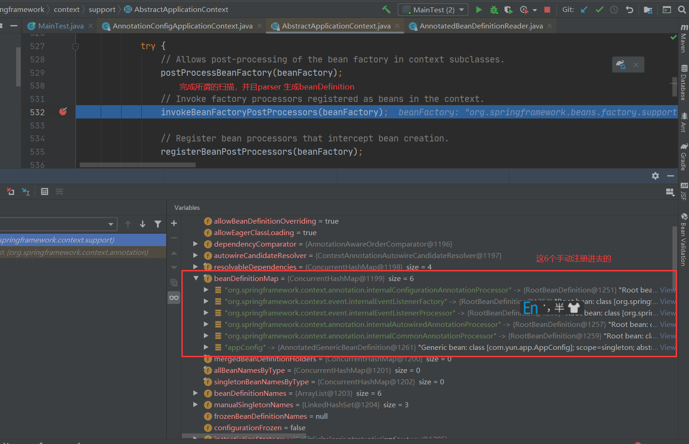
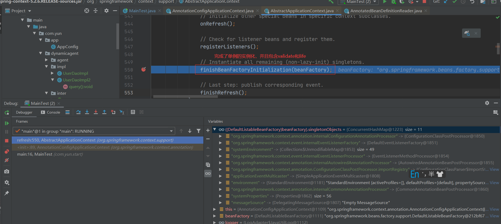
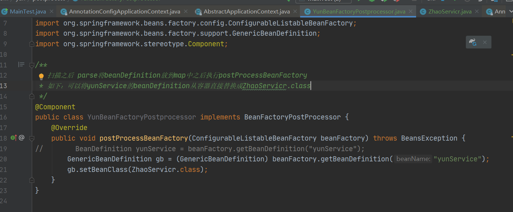
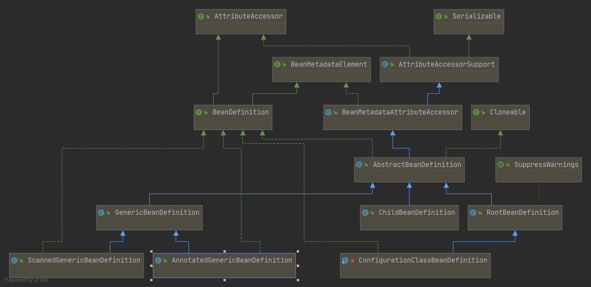

## beanDefinition  
beanDefinition spring当中的class，用来定义一个bean。BeanDefinition当中所有的属性都能够在xml中找到一个标签与之对应。
## spring大致工作过程  
1、扫描  
2、parser----> 就是把一个类文件也就是class变成beanDefinition object ---map<"xx",o>  
3、validate  ---> 
4、life---->遍历bean得到beanDefinition  实例化
***************
spring容器包含几部分{  
YunService bean = ac.getBean(YunService.class);  
这句话实际上是 DefaultSingletonBeanRegistry.getSingleton中的  
Object singletonObject = this.singletonObjects.get(beanName);而singletonObjects就是一个 ConcurrentHashMap 被称为单例池  
aac.getBeanDefinition("yunService")  
org.springframework.beans.factory.support.DefaultListableBeanFactory.getBeanDefinition  
是从beanDefinitionMap 也是个ConcurrentHashMap中拿到beanDefinition
}
~~~
1、所以容器包含这个单例池singletonObject
2、还包含 beanDefinitionMap
~~~
如何理解spring容器 从抽象意义上讲他就是一个ApplicationContext，站在代码角度上讲是由很多组件组成，比如bean的单例池，beanDefinitionMap，以及beanFactory，都可以理解成容器。
******
  
执行完这行代码，所有扫描的bean都会转换成beanDefinition，无论原型还是单例。  
  
上图完成了单例的实例化  
## BeanFactoryPostProcessor 
也就是说后置处理器可以手动将某个bean替换成指定的bean  
  
public interface BeanDefinition extends AttributeAccessor, BeanMetadataElement  
AttributeAccessor这个接口存储beanDefinition的额外信息，是由AbstractBeanDefinition这个类来实现的。  
BeanMetadataElement是存class文件的路径。  
beanDefinition可以修改里面的对象，根据一个类你可以new出来一个实例，同样根据beanDefinition你可以得到一个bean  
### ChildBeanDefinition，RootBeanDefinition，GenericBeanDefinition三者的区别  
RootBeanDefinition 只能做父级beanDefinition    
ChildBeanDefinition 只能做子级beanDefinition  
GenericBeanDefinition可以完全替代ChildBeanDefinition但是不能替代RootBeanDefinition因为merge的时候返回的是RootBeanDefinition（AbstractBeanFactory.getMergedBeanDefinition，这个方法进行merge）         
所有在xml中定义的bean都是GenericBeanDefinition    
AnnotatedGenericBeanDefinition 这个类主要是解析我们定义的配置类AppConfig.class,换句话说是被@Configuration注释的类，ScannedGenericBeanDefinition 是解析有@Component注释的bean  
    