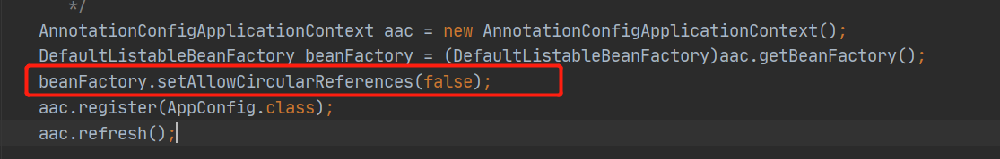
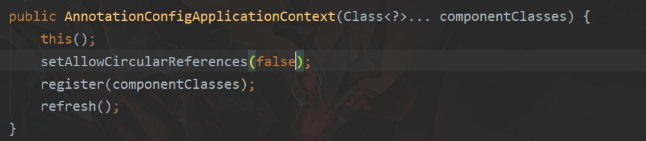

# 循环依赖  
spring提供解决循环依赖必须满足两个条件：  
1、单例；  
2、必须是setter注入，而不是构造函数注入；  
spring 的循环依赖可以手动关闭。  
3、@Autowired是可以解决循环引用的  
## 关闭循环依赖  
两种方式关闭循环依赖  
1、初始化容器的时候手动调用api关闭  
  
2、通过更改代码  
  
3、能成功关闭循环依赖就是在spring属性注入的时候让属性无法注入就可以了。  
4、spring当中怎么体现默认是支持循环依赖的  
~~~
org.springframework.beans.factory.support.AbstractAutowireCapableBeanFactory#allowCircularReferences 
	private boolean allowCircularReferences = true;
~~~
## 实例化bean  
~~~
org.springframework.beans.BeanUtils#instantiateClass(java.lang.reflect.Constructor<T>, java.lang.Object...) 
这个方法中return ctor.newInstance(argsWithDefaultValues);来说实例化bean的
~~~  
~~~
org.springframework.beans.factory.support.AbstractAutowireCapableBeanFactory#doCreateBean 
这个方法中实例化完对象好，判断是否允许循环依赖  
boolean earlySingletonExposure = (mbd.isSingleton() && this.allowCircularReferences &&
				isSingletonCurrentlyInCreation(beanName));
~~~
~~~
org.springframework.beans.factory.support.AbstractAutowireCapableBeanFactory#populateBean
这个方法完成属性注入，之前已经把第一个bean放到三级缓存中了，三级缓存中装的是一个对象工厂，也可以理解为是装半成品的bean
工厂
~~~

## spring 什么时候完成属性注入  
~~~
org.springframework.beans.factory.support.AbstractAutowireCapableBeanFactory#populateBean
这个方法完成属性注入，之前已经把第一个bean放到三级缓存中了，三级缓存中装的是一个对象工厂，也可以理解为是装半成品的bean
工厂
~~~
~~~
org.springframework.beans.factory.annotation.AutowiredAnnotationBeanPostProcessor.AutowiredFieldElement#inject

field.set(bean, value); 这句话完成属性注入
~~~
如果有一个类实现InstantiationAwareBeanPostProcessor重写postProcessAfterInstantiation返回false将不会对属性进行注入
## 解决循环依赖的步骤  
1.创建第一个bean A的时候，是通过无参构造函数构造出一个实例，这个实例依赖的属性是没有填充的，然后会将实例化好的对象放到三级工厂中；
2、然后在属性填充的时候会去实例化依赖的bean B，实例化bean B的时候，属性填充的时候，会把不不完整的A赋值给B，然后成功完成B的实例化；  
3、这时候回来填充A依赖的B，也就把A成功构造出来，放入单例池，由于B的属性引用的是A的地址值，所以B此时也完成了依赖。

4、三级缓存装的是工厂  
~~~
private final Map<String, Object> singletonObjects = new ConcurrentHashMap<>(256);

	/** Cache of singleton factories: bean name to ObjectFactory. */
	private final Map<String, ObjectFactory<?>> singletonFactories = new HashMap<>(16);

	/** Cache of early singleton objects: bean name to bean instance. */
	private final Map<String, Object> earlySingletonObjects = new HashMap<>(16);
~~~