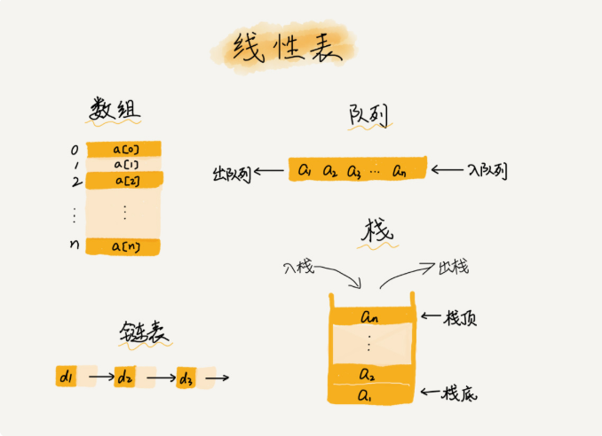
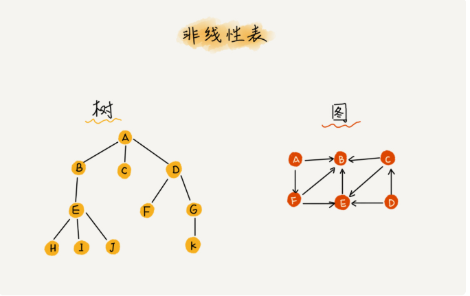
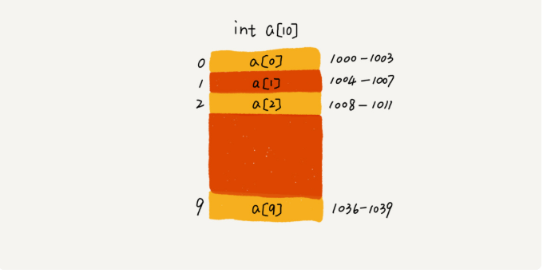
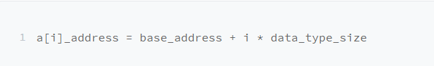

## 概念
数组（Array）是一种线性表结构，它用一组连续的内存空间，来存储一组具有相同类型的数据。
### 线性表
线性表就是数据排成像一条线一样的结构，每个线性表上的数据只有前和后两个方向的数据，除了数组，链表队列，栈都是线性结构。

而与他对应的是非线性表。
### 非线性表
比如二叉树、堆、图等。之所以叫非线性，是因为，在非线性表中，数据之间并不是简单的前后关系。

### 连续的内存空间和相同的数据类型
正是因为这两个特性，使他有了随机访问的属性。但是这个两个特性有利有弊，这两个特性也让数组的某些操作变得非常低效，比如删除、插入，为了保证连续的内存空间，所以需要大量的数据搬迁工作。  
***数组如何实现随机访问的呢***  
我们拿一个长度为 10 的 int 类型的数组 int[] a = new int[10]来举例。在我画的这个图中，计算机给数组 a[10]，分配了一块连续内存空间 1000～1039，其中，内存块的首地址为 base_address = 1000。

我们知道，计算机会给每个内存单元分配一个地址，计算机通过地址来访问内存中的数据。当计算机需要随机访问数组中的某个元素时，它会首先通过下面的寻址公式，计算出该元素存储的内存地址：

其中 data_type_size 表示数组中每个元素的大小。我们举的这个例子里，数组中存储的是 int 类型数据，所以 data_type_size 就为 4 个字节。
## 思考
二维数组的寻址地址是啥？
二维数组内存寻址：
对于 m * n 的数组，a [ i ][ j ] (i < m,j < n)的地址为：  
***address = base_address + ( i * n + j) * type_size***