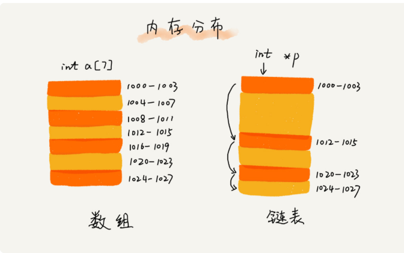

## 常见的三种缓存策略
1.先进先出FIFO（First In，First Out）  
2.最少使用策略LFU（Least Frequently Used）  
3.最近最少使用策略LRU（Least Recently Used）  
## 数组和链表的内存结构图  
   
例如当内存中没有连续的空间时，是无法给数组申请内存空间，但是链表却可以申请，它并不需要一块连续的内存空间，它通过“指针”将一组零散的内存块串联起来使用。  
## 常用的三种链表  
### 单链表  
  
链表通过指针将一组零散的内存空间串联在一起，我们把内存块称为链表的 ***结点*** ，为了将链表连起来，每个结点除了存储数据外，还需要记录下一个节点的地址，我们把这个记录下一个结点的地址的指针叫做 ***后继指针 next*** 。  
从链表图上可以看出头结点和尾结点比较特殊，头结点用来记录链表的基地址，有了它，我们就可以遍历得到整条链表。而尾结点特殊的地方是：指针不是指向下一个结点，而是指向一个空地址 NULL，表示这是链表上最后一个结点。  
与数组一样，链表也支持插入和删除。  
我们知道，在进行数组的插入、删除操作时，为了保持内存数据的连续性，需要做大量的数据搬移，所以时间复杂度是 O(n)。而在链表中插入或者删除一个数据，我们并不需要为了保持内存的连续性而搬移结点，因为链表的存储空间本身就不是连续的。所以，在链表中插入和删除一个数据是非常快速的。  
为了方便你理解，我画了一张图，从图中我们可以看出，针对链表的插入和删除操作，我们只需要考虑相邻结点的指针改变，所以对应的时间复杂度是 O(1)。
  
所以随机读取就不会像数组那样根据首地址和下标根据寻址公式去查找元素，而是需要根据指针一个结点一个结点去遍历才可以。  
### 循环链表  
***循环链表是一种特殊的单链表***。实际上，循环链表也很简单。它跟单链表唯一的区别就在尾结点。我们知道，单链表的尾结点指针指向空地址，表示这就是最后的结点了。而循环链表的尾结点指针是指向链表的头结点。从我画的循环链表图中，你应该可以看出来，它像一个环一样首尾相连，所以叫作“循环”链表。  
  
和单链表相比，循环链表的优点是从链尾到链头比较方便。当要处理的数据具有环型结构特点时，就特别适合采用循环链表，比如著名的 ***约瑟夫问题***。  
### 双向链表  
单向链表只有一个方向，结点只有一个后继指针 next 指向后面的结点。而双向链表，顾名思义，它支持两个方向，每个结点不止有一个后继指针 next 指向后面的结点，还有一个前驱指针 prev 指向前面的结点。  
  
### 设计思想 —— 空间换时间  
当内存空间充足的时候，如果我们更加追求代码的执行速度，我们就可以选择空间复杂度相对较高、但时间复杂度相对很低的算法或者数据结构。相反，如果内存比较紧缺，比如代码跑在手机或者单片机上，这个时候，就要反过来用时间换空间的设计思路。
## 思考
### 基于链表实现LRU缓存淘汰算法  
```
维护一个有序单链表，越靠近链表尾部的结点是越早之前访问的。当有一个新数据被访问的时候，我们从链表头开始顺序遍历链表。
1、如果此数据之前已经被访问过，我们遍历找到这个元素对应的节点，删除，然后把这个元素插到链表的头部。  
2、如果这个元素没有被访问过，又存在2种情况：  
* 如果缓存没满，将此节点直接插入链表的头部；  
* 如果满了，将尾部节点删除，将该元素插到链表头部。  
```
### 基于数组实现LRU缓存淘汰算法  

### 如何判断一个字符串是否是回文字符串的问题  
如果字符串是通过单链表来存储的，那该如何来判断是一个回文串呢？你有什么好的解决思路呢？相应的时间空间复杂度又是多少呢？  
### 什么是CPU的缓存机制  
```
CUP从内存中读取数据的时候，会将读到的数据放入CPU缓存中，而CPU每次从内存中读取数据并不是只读取那个特定要访问的地址，而是读取一个数据块（大小我不太确定），并保存在CPU缓存中，然后下次访问内存数据的时候先从CPU缓存中读取，如果找到就不去内存中取了，这样就实现了比内存访问更快的机制，这也是CPU缓存机制存在的意义：弥补内存访问速度过慢，与CPU执行速度快之间的差异。所以，对于数组，因为是连续的内存空间,所以一次会读取目标地址以后得几个元素也读到CPU缓存中，所以下次访问就更快了。
```
### 手撸链表的技巧  
1.理解指针或者引用的含义；  
存储所指对象的内存地址。  
2.警惕指针丢失和内存泄漏；  
3.利用哨兵简化实现难度；  
4.重点留意边界处理条件。  
### 实践总结  
~~~
1、链表通过下标获取指定元素，其实就是遍历，所以时间复杂度是O(n);
2、数组是通过寻址公式来获取指定元素的；
3、源码是先把传入的值和链表的长度的一半比了一下，从而来减少遍历时间。
~~~