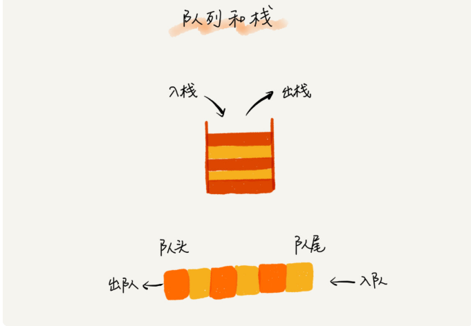
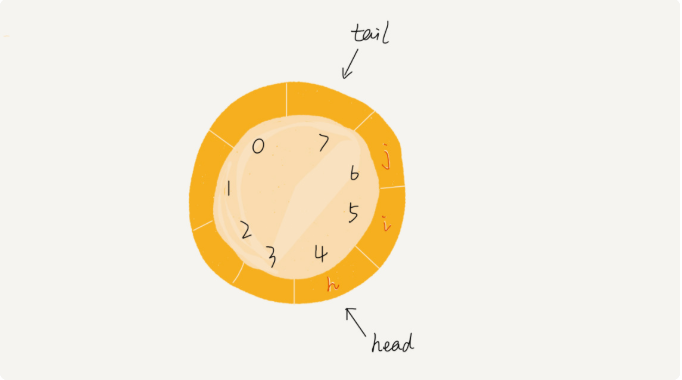
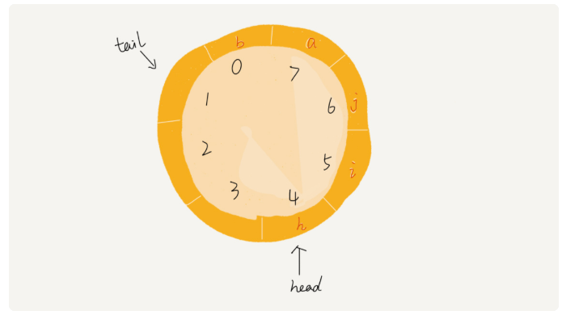
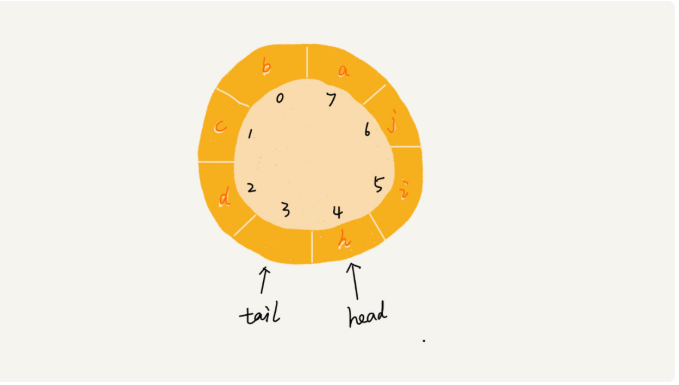

## 队列 queue
### 前言  
CPU资源是有限的，任务的处理速度与线程的个数并不是正相关，相反，过多的线程反而会导致CPU频繁的切换，处理性能下降。
### 特性  
先进先出，支持2个操作，入队和出队    
  
### 顺序队列  
### 链式队列  
### 循环队列  
  
上图中的队列大小为8，当前 head=4，tail=7。当有一个新元素a入队的时候，我们放入下标为 7 的位置，但是，我们不将tail加1更新为8，而是将其在环中向后移动一位，到下标为0的地方，当再有一个元素 b 入队时，我们将 b 放入下标为 0 的位置，然后 tail 加 1 更新为 1。所以，在 a，b 依次入队之后，循环队列中的元素就变成了下面的样子：  
  
环形队列队空和队满的判定条件：  
在用数组实现的非循环队列中，队满的判断条件是 tail == n，队空的判断条件是 head == tail。那针对循环队列，如何判断队空和队满呢？  
队列为空的判断条件仍然是 head == tail。但队列满的判断条件就稍微有点复杂了。我画了一张队列满的图，你可以看一下，试着总结一下规律。  
   
就像我图中画的队满的情况，tail=3，head=4，n=8，所以总结一下规律就是：(3+1)%8=4。多画几张队满的图，你就会发现，当队满时，***(tail+1)%n=head***。  
你有没有发现，当队列满时，图中的 tail 指向的位置实际上是没有存储数据的。所以，循环队列会浪费一个数组的存储空间。  
### 阻塞队列和并发队列  
#### 阻塞队列  
简单来说，就是队列为空的时候，从队头取元素会被阻塞，因为没有数据可取，直到队列中有数据才可以返回。如果队列已经满了，插入元素就会被阻塞，直到队列有空位置才可以插入，然后再返回。  
#### 并发队列  
线程安全的的队列，就是并发队列。  
### 思考  
~~~
1、循环队列：队列满的表达式
这里讲一下，这个表达式是怎么来的。在一般情况下，我们可以看出来，当队列满时，tail+1=head。但是，有个特殊情况，就是tail=n-1，而head=0时，这时候，tail+1=n，而head=0，所以用(tail+1)%n == n%n == 0。而且，tail+1最大的情况就是 n ，不会大于 n，这样，tail+1 除了最大情况，不然怎么余 n 都是 tail+1 本身，也就是 head。这样，表达式就出现了。  
2、循环队列的长度设定需要对并发数据有一定的预测，否则会丢失太多请求。
3、在原有数组的基础上用System.arraycopy进行数组搬移，不会将原数组清空，例如 a[]={null,22,33,44},如果搬移会变成a[]={22,33,44,44}
~~~
### 注意细节  
~~~
1、head指针总是指向当前元素，但是tail指针指向的是一个空位置，当添加元素的时候，tail要加1，指向下一个空位置，而不是指向当前元素；
~~~