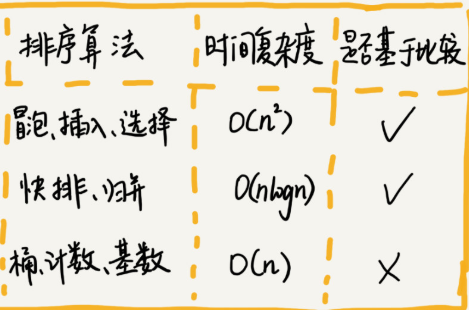
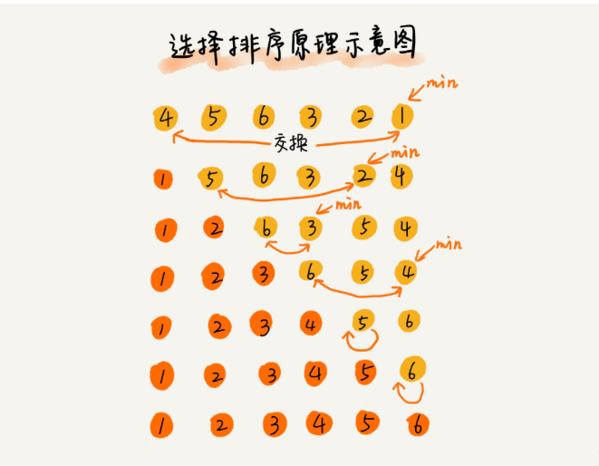
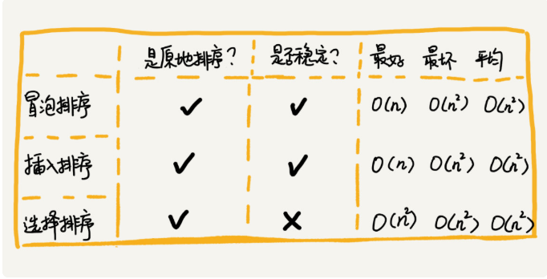

## 排序  
8中排序算法对比  
  
### 1、插入排序和冒泡排序时间复杂度都是O(n2)，但是实际开发中为什么喜欢用插入排序而不是冒泡排序？  
### 2、如何分析一个排序算法  
#### 2.1、排序算法的执行效率  
2.1.1、最好情况，最坏情况，平均情况的时间复杂度；  
2.1.2、时间复杂度的系数、常数、低阶；  
2.1.3、比较次数和交换（移动次数）  
#### 2.2、排序算法的内存消耗  
原地排序（sorted in place）：就是特指空间复杂度是O(1)的排序算法。  
#### 2.3、排序算法的稳定性  
我通过一个例子来解释一下。比如我们有一组数据 2，9，3，4，8，3，按照大小排序之后就是 2，3，3，4，8，9。  
排序之后，如果第一个3位置变了，就是***不稳定排序算法***反之就是***稳定的排序算法***  
### 3、冒泡排序（Bubble Sort）  
冒牌排序只会操作相邻的两个数据。每次冒泡都会对相邻的两个数据进行比较，如果不满足就互换，重复n次，就完成了排序。  
3.1、冒泡排序是原地排序算法吗？
只涉及相邻数据交换，只需要常量级的临时空间，所以空间复杂度是O(1)，是原地排序算法。  
3.2、冒泡排序是稳定排序算法吗？  
是，比较的过程中，相同的元素位置不交换即可。  
3.3、冒泡排序时间复杂度是多少？  
最好：已经有序，比对n次即可，进行一次冒泡操作，所以是O(n);  
最坏：倒序，比对n*n次，冒泡n次，所以是O(n2);  
### 4、插入排序（Insertion Sort）  
思想：将数组分为两个区间，***已排序区间***和***未排序区间***，初始已排序区间只有一个元素，就是数组的第一个元素。插入的核心思想就是取未排序区间的元素往已排序的区间插入，直到未排序区间没有元素。
### 5、选择排序算法（Selection Sort）  
选择排序也分***已排序区间***和***未排序区间***，与插入排序不同的是，每次都需要在未排序区间选择最小的元素，放到已排序元素的末尾。    
  
选择排序是不稳定排序算法
### 6、三者对比  
选择排序：每次都是在未排序的数组中找到最小的，然后放在已排序的末尾；   
插入排序：在未排序的数组取元素，然后往已排序的插入；  
冒泡排序：只对比相邻的2个元素，把最大的或者最小的放到最后。  
### 7、小结  
要想分析、评价一个排序算法，需要从执行效率、内存消耗和稳定性三个方面来看。  
 
