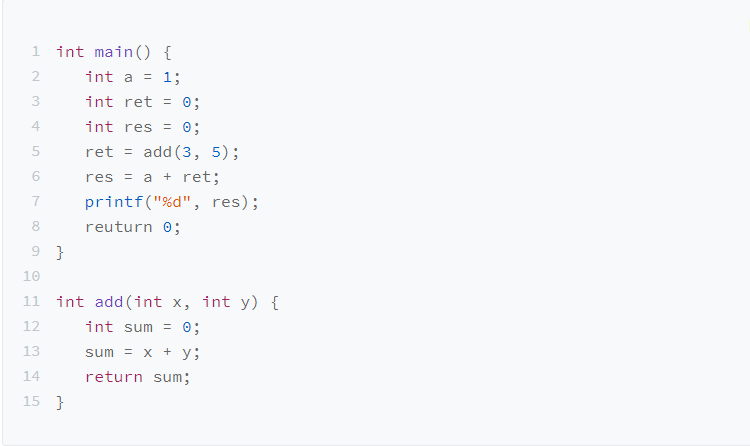
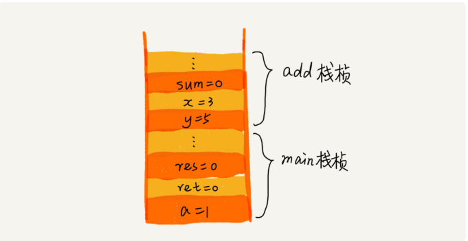
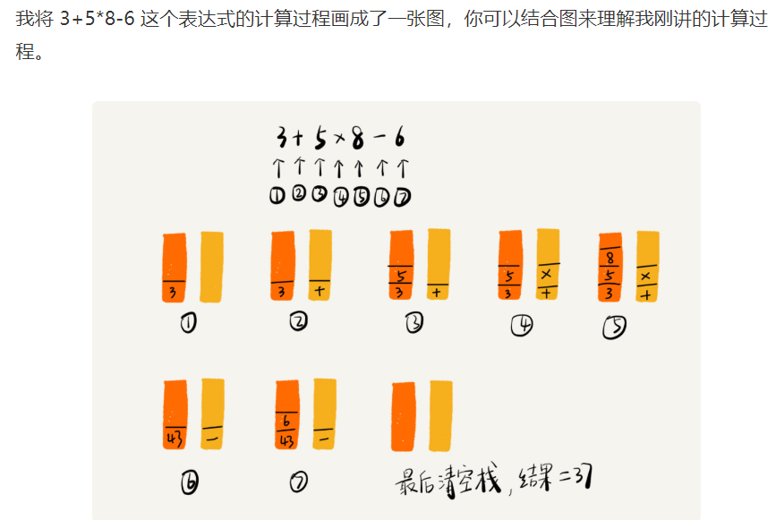

## 栈  
后进先出，先进者后出，栈是一种***操作受限***的线性表，只允许一端插入和删除数据。
### 如果用代码实现一个栈  
1.栈只包含2个动作，入栈和出栈，也就是在栈顶插入一个数据，在栈顶在删除一个数据。
2.数组实现的栈叫顺序栈，链表实现链式栈。
### 栈的时间复杂度和空间复杂度  
~~~
1、空间复杂度：在出栈和入栈的过程中，只需要额外的一两个临时变量就存储空间，所以空间复杂度就是O(1)。
这里需要一个大小为n的数组，并不是说空间复杂度就是O(n)，空间复杂度是指，除了原本数据存储空间之外的，算法运行还需要的额外存储空间。  
2、时间复杂度：无论出栈还是入栈，都只是对一个元素的操作，所以时间复杂度就是O(1)。  
3、动态扩容栈的时间复杂度：当栈有空间的时候，最好的时间复杂度是O(1)，当栈满了之后需要搬移元素，所以时间复杂度是O(n)，那平均复杂度是多少呢？  
摊还分析法：
~~~
### 栈的应用  
***1、函数调用：***    
操作系统给每个线程分配一个独立的内存空间，这块内存被组织成***栈*** 用来存储函数的临时变量。每进入一个函数，就会将临时变量作为一个栈帧入栈，当被调用函数执返回之后，将这个函数执行完，返回之后，将这个函数对应的栈帧出栈。  
    
从代码上看main()函数调用add()函数，获取结果，并与临时变量a相加   
  
***2、栈在表达式求值中的应用***    
编译器如何用栈来求值表达式  3+5*2-1  
通过2个栈来实现，一个栈装数字，一个栈装运算符，从左向右遍历表达式，遇到数字放在操作数栈，遇到符号和符号栈栈顶元素比对优先级，如果优先级高于栈顶元素压栈后继续遍历，如果低于或者等于栈顶元素优先级，从操作数栈取2个元素和栈顶元素做运算，结果放在操作数栈，然后继续用该操作符元素与栈顶元素做比对。  
  
***3、栈在括号匹配中的应用***  
我们用栈来保存未匹配的左括号，从左到右依次扫描字符串。当扫描到左括号时，则将其压入栈中；当扫描到右括号时，从栈顶取出一个左括号。如果能够匹配，比如“(”跟“)”匹配，“[”跟“]”匹配，“{”跟“}”匹配，则继续扫描剩下的字符串。如果扫描的过程中，遇到不能配对的右括号，或者栈中没有数据，则说明为非法格式。  
### 课后思考  
~~~
1、我们在讲栈的应用时，讲到用函数调用栈来保存临时变量，为什么函数调用要用“栈”来保存临时变量呢？用其他数据结构不行吗？  

2、我们都知道，JVM 内存管理中有个“堆栈”的概念。栈内存用来存储局部变量和方法调用，堆内存用来存储 Java 中的对象。那 JVM 里面的“栈”跟我们这里说的“栈”是不是一回事呢？如果不是，那它为什么又叫作“栈”呢？
~~~