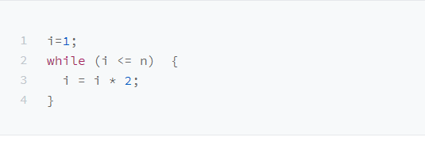
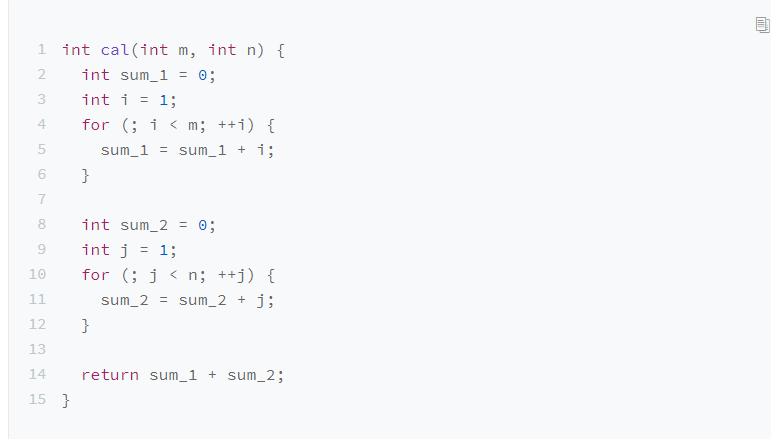

### 时间复杂度
#### 大O表示法
所有代码的执行时间 T(n) 与每行代码的执行次数 n 成正比。  
总结成一个公式  
  
T(n)它表示代码执行的时间；n 表示数据规模的大小；f(n) 表示每行代码执行的次数总和。因为这是一个公式，所以用 f(n) 来表示。公式中的 O，表示代码的执行时间 T(n) 与 f(n) 表达式成正比。  
大O表示法实际上并不是代表代码运行的具体时间，而是表示代码执行时间和数据量成正比，所以也叫做**渐进式时间复杂度**，简称时间复杂度。  
#### 如何分析一段代码的时间复杂度
1.只关注循环执行次数最多的一行代码；
  
2.加法法则：总复杂度等于量级最大的那段代码的复杂度；
   
也就是说，总的时间复杂度等于量级最大的那段代码的时间复杂度；  
3.乘法法则，嵌套代码的时间复杂度等于嵌套内外代码复杂度的乘积；
   
#### 几种常见的时间复杂度实例分析  

对于刚罗列的复杂度量级，我们可以粗略地分为两类，***多项式量级***和 ***非多项式量级***。其中，***非多项式量级只有两个：O(2n) 和 O(n!)***。  
我们把时间复杂度为非多项式量级的算法问题叫做NP（Non-Deterministic Polynomial，非确定多项式）问题。  
当数据项增大的时候，非多项式量级算法的时间将急剧增加。  
##### 多项式时间复杂度  
1.O(1)  
首先我们必须明确，O(1)只是常量级时间复杂度表示方法，并不是只执行了一行代码，所以，***一般情况下，只要算法中不存在循环语句、递归语句，即使有成千上万行的代码，其时间复杂度也是Ο(1)。***  
2.O(logn)、O(nlogn)
 
计算循环次数，是一个等比数列所以，我们只要知道 x 值是多少，就知道这行代码执行的次数了。通过 2x=n 求解 x 这个问题我们想高中应该就学过了，我就不多说了。x=log2n

3.O(m+n)、O(m*n)  

从代码中可以看出，m 和 n 是表示两个数据规模。我们无法事先评估 m 和 n 谁的量级大，所以我们在表示复杂度的时候，就不能简单地利用加法法则，省略掉其中一个。所以，上面代码的时间复杂度就是 O(m+n)。针对这种情况，原来的加法法则就不正确了，我们需要将加法规则改为：T1(m) + T2(n) = O(f(m) + g(n))。但是乘法法则继续有效：T1(m)*T2(n) = O(f(m) * f(n))。  
### 空间复杂度  
前面我讲过，时间复杂度的全称是渐进时间复杂度，表示算法的执行时间与数据规模之间的增长关系。类比一下，空间复杂度全称就是渐进空间复杂度（asymptotic space complexity），表示算法的存储空间与数据规模之间的增长关系。

跟时间复杂度分析一样，我们可以看到，第 2 行代码中，我们申请了一个空间存储变量 i，但是它是常量阶的，跟数据规模 n 没有关系，所以我们可以忽略。第 3 行申请了一个大小为 n 的 int 类型数组，除此之外，剩下的代码都没有占用更多的空间，所以整段代码的空间复杂度就是 O(n)。我们常见的空间复杂度就是 O(1)、O(n)、O(n2)，像 O(logn)、O(nlogn) 这样的对数阶复杂度平时都用不到。而且，空间复杂度分析比时间复杂度分析要简单很多。所以，对于空间复杂度，掌握刚我说的这些内容已经足够了。
### 内容小结  
复杂度也叫渐进复杂度，包括时间复杂度和空间复杂度，用来分析算法执行效率与数据规模之间的增长关系，可以粗略地表示，越高阶复杂度的算法，执行效率越低。常见的复杂度并不多，从低阶到高阶有：O(1)、O(logn)、O(n)、O(nlogn)、O(n2)，几乎所有的数据结构和算法的复杂度都跑不出这几个。
